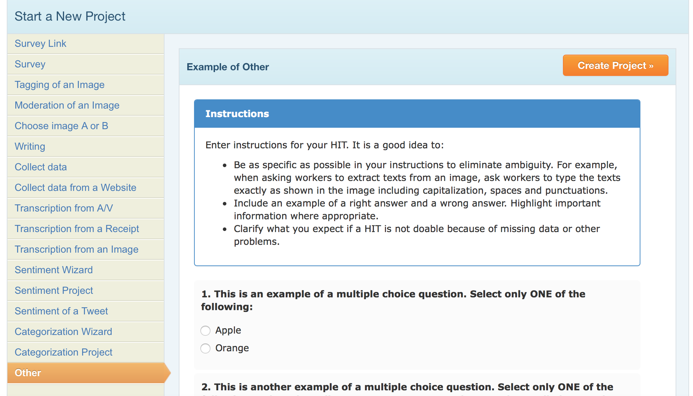
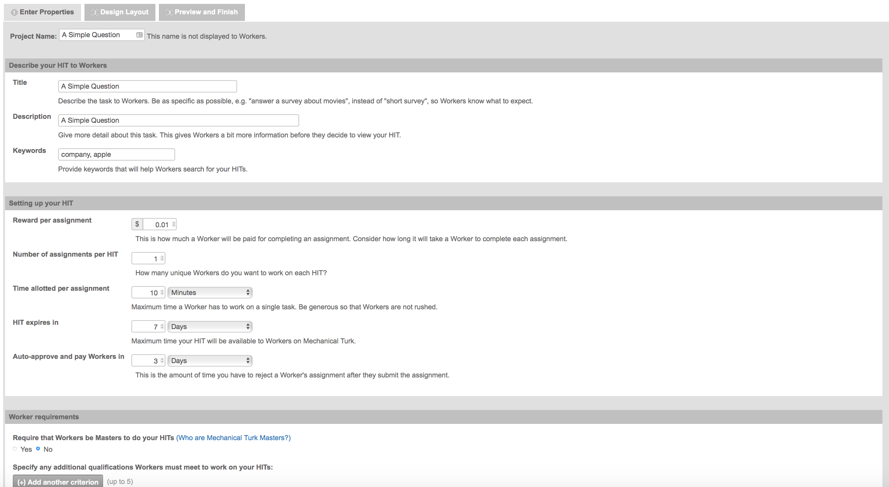

# Crowdsourcing Image Annotations - Part 2
In this tutorial, we are going to use Boto3, the AWS SDK for Python Version 3, to access the Amazon Mechanical Turk API. After installing the Boto SDK, we are going to use Boto3 for croudsourcing image annotations.

This second part shows how to use Boto3 to create HITs with the MTurk Requester Website using a HITLayout data structure, and scale the loading of those HITs with Python using Boto3.


## Create a Project
After you’ve signed up, the first step is to create a HIT layout in the Requester website. To create a layout, you need to first create a project. Log in to https://requestersandbox.mturk.com/ and then click on “Create” and then click on “New Project”.


You will be asked what kind of Project you want to create. Click on the “Other” option.



On the next page, fill out the properties section. Note that the values you fill out in the properties section can be defined later in your code.



Once done, click on the “Design Layout” tab.

## Design your HIT
In the Design Layout section, you can set up your HIT layout using HTML markup. You can then add template variables which you will substitute with real data when you actually start creating HITs using this layout later on. First, click on the “Source” button to reveal the source code for the template.


Now replace the boilerplate source code you above with the following:

```html
<!-- Bootstrap v3.0.3 -->
<link href="https://s3.amazonaws.com/mturk-public/bs30/css/bootstrap.min.css" rel="stylesheet" />
<section class="container" id="Other" style="margin-bottom:15px; padding: 10px 10px; font-family: Verdana, Geneva, sans-serif; color:#333333; font-size:0.9em;">
<div class="row col-xs-12 col-md-12">
<!-- Content Body -->
<section>
<fieldset>
    <div class="input-group"><label>${question}</label> 
    <input class="form-control" name="answer" size="120" type="text" />
    </div>
</fieldset>
</section>
<!-- End Content Body --></div>
</section>
<!-- close container -->
<style type="text/css">fieldset { padding: 10px; background:#fbfbfb; border-radius:5px; margin-bottom:5px; }
</style>
```

In the bold area above, we replaced the question text “Please name the company that created the iPhone” with the value “${question}” in order to turn it into a parameter. This will all come full circle in a moment.

Once saved, you’ll want to click the Project’s name to bring up this dialog box:


## Writing the code
The previos screen contains the Layout ID and the Layout Parameters that you’ll want to include in your Boto3 code. Notice the “question” Layout Parameter. MTurk automatically detected the “${question}” tag you included in your HTML above, and recognized it as a parameter. Now, to use this in your Python code, simply revise the code from earlier to the following:


```python
import boto3

# Use the Amazon Mechanical Turk Sandbox to publish test Human Intelligence Tasks (HITs) without paying any money.
# Uncomment the below to connect to the live marketplace
host = 'https://mturk-requester-sandbox.us-east-1.amazonaws.com'
# host = 'us-east-1'


client = boto3.client('mturk', endpoint_url=host)

response = client.create_hit_with_hit_type(
    HITLayoutId="3YE1UIALX94QYY1GN5SKK1YWYB4NS7",
    HITTypeId="3XJ5RHVJOB39FCG8U024796RGNXXLM",
    HITLayoutParameters=[
        {
            'Name': 'question',
            'Value': 'Please name the company that created the iPhone'
        },],
    LifetimeInSeconds=600,
)


# The response included several fields that will be helpful later
hit_type_id = response['HIT']['HITTypeId']
hit_id = response['HIT']['HITId']
print("Your HIT has been created. You can see it at this link:")
print("https://workersandbox.mturk.com/mturk/preview?groupId=" + hit_type_id)
print("Your HIT ID is: " + hit_id)

```

    Your HIT has been created. You can see it at this link:
    https://workersandbox.mturk.com/mturk/preview?groupId=3XJ5RHVJOB39FCG8U024796RGNXXLM
    Your HIT ID is: 34XASH8KLQM5MTOJETOLTT6MERUPMZ


You’ll see that we referenced the “question” HITLayoutParameters, and supplied it a value (“Please name the company that created the iPhone”). We then referenced the HIT Layout ID from the screenshot, and the HIT Type ID (to define the title, reward amount, and more without having to specify each in our code). Notice how this is less than half as many lines of code as in our previous example. This is because all of the definition of the question has been stored in a HITLayout data structure and the HIT parameters are stored in a HIT Type ID. They are only referenced in this code. Even better, now to create a new HIT but asking a different question, we need only change the line:

```python
HITLayoutParameters=[{
            'Name': 'question',
            'Value': 'Please name the company that created the iPhone'},]
```

to something new. For example:

```python
HITLayoutParameters=[{
            'Name': 'question',
            'Value': 'Who is the CEO of Amazon?'},]
```

## Wrapping up
Although the code to create HITs has changed, the ways we showed in our last tutorial to retrieve results, approve the assignments, and dispose of the HITs is still the same. This means you can easily get started with HTMLQuestion, but if you have more complex templates, or want to separate your question authoring from you code, you can do so with a HITLayout data structure.

That’s it. You have now completed all the steps needed to create HITs using a HITLayout data structure and the MTurk Requester Website.
